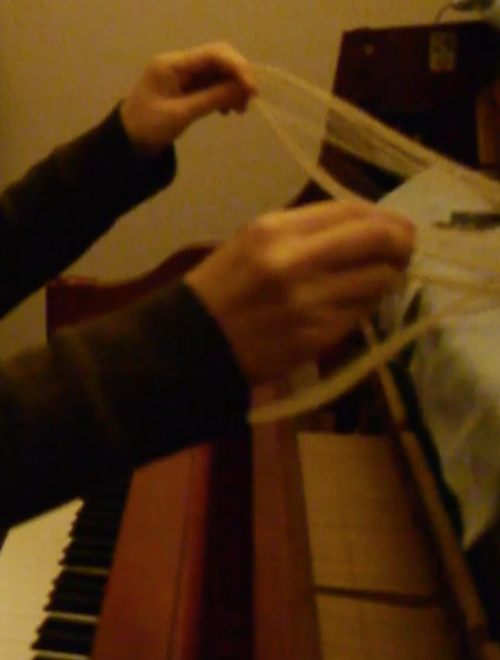
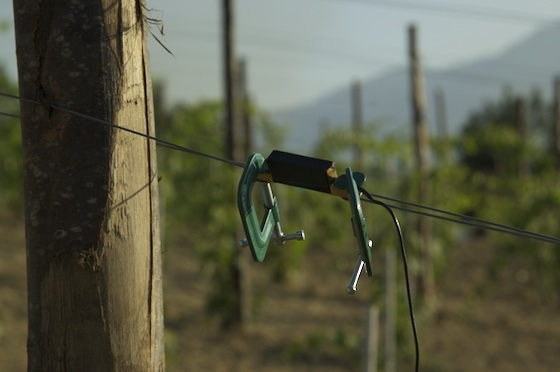

<!--[About](post/aboutcv.md) -->
[News](post/news.md) 
[Buy](post/buy.md) 
[Read](post/materials.md)  
<!--[Project Links](post/pl.md)  -->

  

11/Jiyeon Kim  

11 is Seoul based sound artist Jiyeon Kim's musical moniker.  
"11" is a name derived from the shape of 틈(gap in Korean), from which she often finds her creative force.   

Since her debut ep album '11' in 2014, she's been performing and composing music with electronics, field recordings, vocal, and piano as main sound palette. She is also interested in the use of audio playback technology and data formats as instruments. As a sound artist, she presents sound installations, interdisciplinary performances and writings based on her listening experiences and her reflections on them.   

Under her real name, she released a piano sampling album 'Long Decay and New Earth'(Label: Tapeworm UK), which was selected as Top 20 Tapes in 2020 by hhv-mag.com (DE). She is also a music composer for film and tv documentary, including 'Kim-Gun(Director Kang Sang-woo). She plays piano at piano-drum project 11min, whose first vinyl album 'snow' was distributed by Greunrekoder in Europe.  

Discography 

2014 '11' EP 
2017 'Transparent Music' 
2019 11 min - <a href="https://www.gruenrekorder.de/?page_id=17951">'snow'</a>  
2020 Jiyeon Kim - <a href="https://www.tapeworm.org.uk/ttw129.html">'Long Decay and New Earth'</a>   

bc: <a href="11ep.bandcamp.com">11ep.bandcamp.com</a> 
instagram: [@jiyeonkimsound](https://instagram.com/jiyeonkimsound) 
email: teum11@gmail.com 

